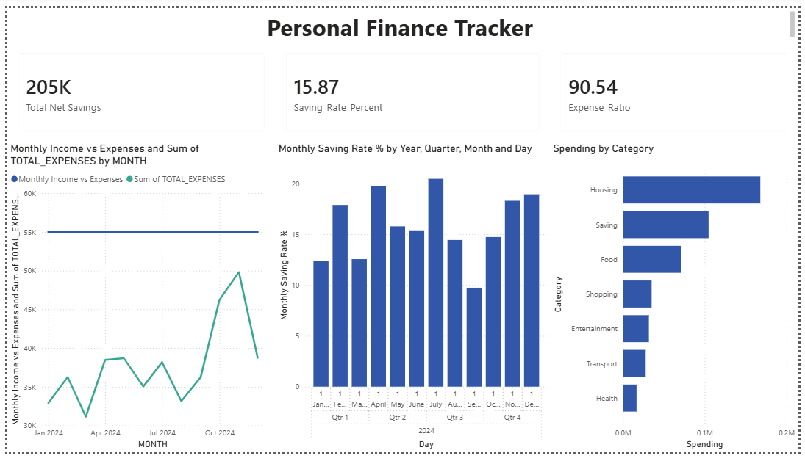

# 💰 Personal Finance Tracker — 2024

## Project Overview
Analyzed 12 months of personal financial transactions for a 
simulated individual to identify spending patterns, savings 
rate trends, and overspending months using SQL and Power BI.

## Tools Used
- SQL — Oracle SQL Plus (Data Analysis & Querying)
- Power BI (Interactive Dashboard)
- Excel (Data Preparation)

## Dataset
- 96 transactions across 12 months
- Categories: Housing, Food, Transport, Entertainment, 
  Shopping, Health, Savings
- Monthly Income: ₹55,000

## SQL Queries performed
1. Monthly Income vs Expenses vs Net Savings
2. Spending by Category (Full Year)
3. Monthly Savings Rate %
4. Months where Expenses exceeded 80% of Income
5. Highest Spending Month per Category

## Key Insights
- Housing consumes 36.93% of total annual spending
- Oct & Nov 2024 were overspending months (84–90% expense ratio) due to festive season
- Best savings month was July 2024 at 20.46% savings rate
- Average annual savings rate was 15.87%
- Total net savings across 12 months: ₹2.05 Lakhs

## Files
- `personal_finance.csv` — Raw transaction dataset
- `query1_income_expenses.csv` — Monthly income vs expenses
- `query2_category_spending.csv` — Category wise spending
- `query3_savings_rate.csv` — Monthly savings rate
- `query4_overspending.csv` — Overspending months
- `query5_clean.csv` — Peak spending per category
- `Personal_Finance_Tracker.pbix` — Power BI Dashboard

## Dashboard Preview

